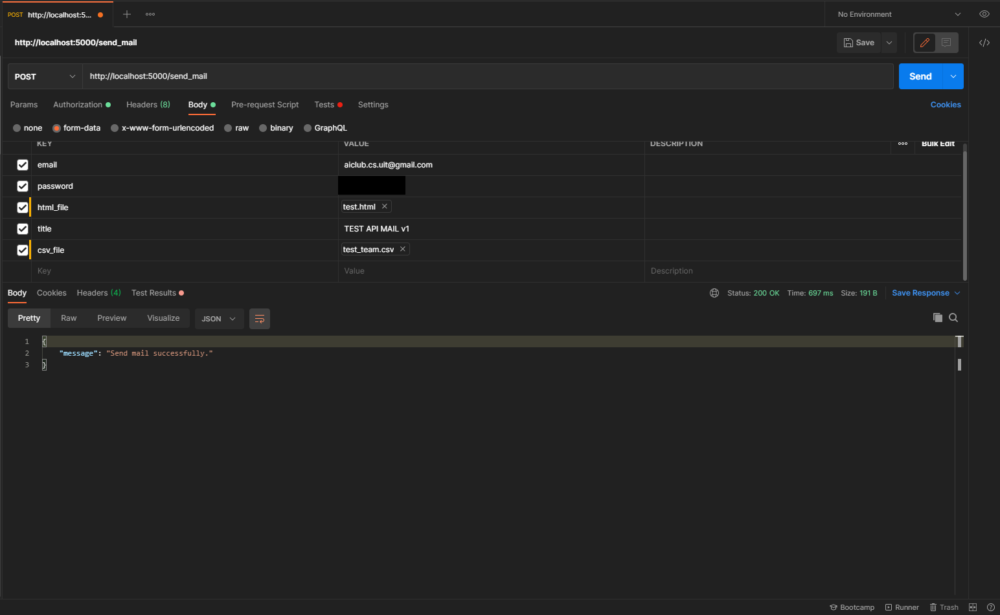

## Sending Multiple Emails Automatically
------------------
Run ```python3 main.py``` to use the API

* **URL**
```
  localhost:5000
```
* **Method:**
  
    `POST`

*  **URL Params**

   ```
   send_mail
   ```

   **Required:**
 
   `email=[str]`
   
   `password=[str]`
   
   `title=[str]`

   `csv_file=[file]`

   `html_file=[file]`  

* **Success Response:**
  
  If you send email successfully, the API will send back the message with content:

  * **Code:** 200 <br />
    **Content:** `"Sent {numb_email} mails successfully."`

* **Sample Call:**
  
  Use [Postman](https://www.postman.com/downloads/) to easily interact. You can use the sample like the image below:

  

* **Note:**
  
  The ``` csv ``` and ``` html ``` are located in the ```sample_file``` folder, you must follow the format of those files to send email successfully.